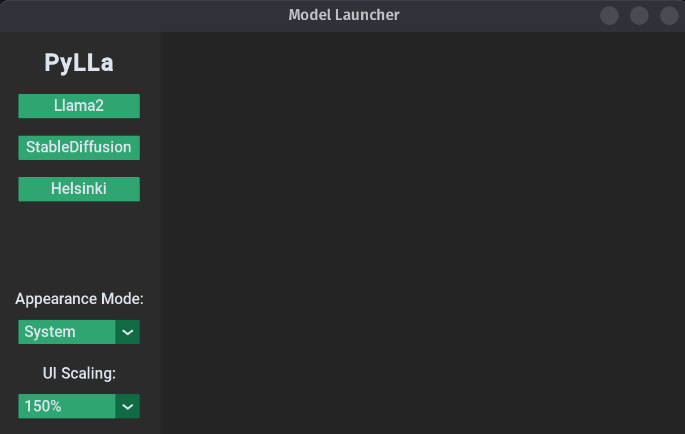
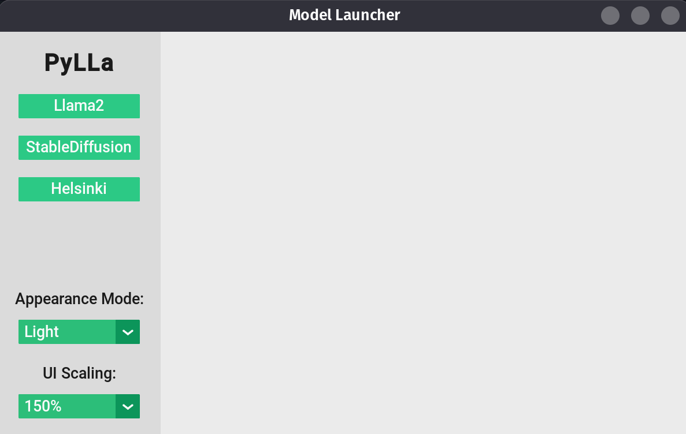
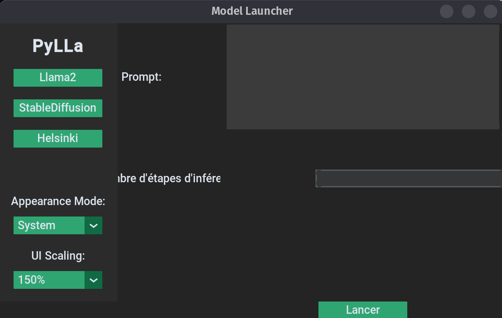
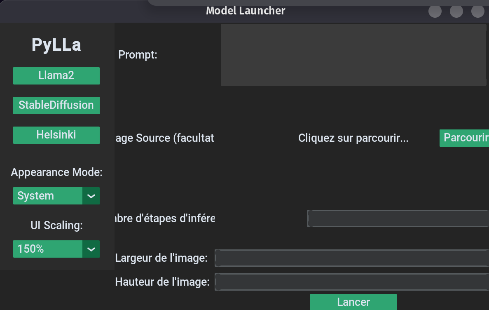
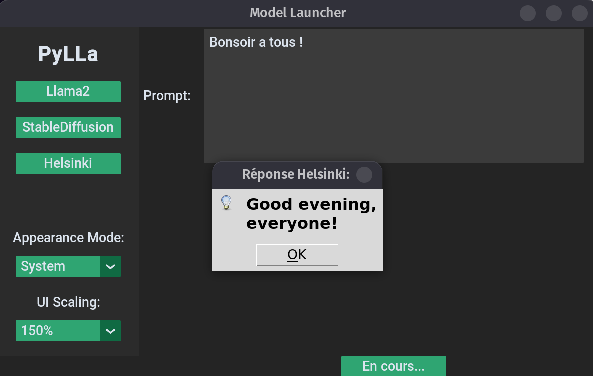

# PyLla


PyLlA is a python package to use Large Langage Models to generate images based on text prompts in your own projects.

## Screenshots








## Installation

 - Install python 3.7.9 manually. https://www.python.org/downloads/
 
 - Clone the repository.
```sh
git clone git@github.com:SAE-LLM/pylla.git
cd pylla
```
 - Launch the corresponding installation script based on your operating system to install the complete python environment.

### Windows
```sh
bash installation/installation.bat
```
### Linux
```sh
sh installation/installation.sh
```


## Usage

Import PyLla in your project as a package
```python
import pylla
```


### Llama2:
Generate an image based on a text prompt with Llama2:
```python
llama2_generator()
```
### StableDiffusion:
Download model:
```python
download_model()
```
Generate an image based on a text prompt with StableDiffusion:
```python
text_to_image(self,options)
<options>:
    prompt: str
    output_path: str
    num_inference_steps: int
    width: int = 256
    height: int = 256
```
Generate an image based on a text prompt with StableDiffusion:
```python
image_to_image(self,options)
<options>:
    prompt: str
    img_url: str
    output_path: str
    num_inference_steps: int
    width: int = 256
    height: int = 256
```

### Helsinki:
Generate an translation FR-EN with Helsinki:
```python
helsinki_generator(prompt)
    <prompt> : text prompt to translate (in french)
```

### UI

Simply run the main.py script:

```py
python3 main.py
```

## Documentation

Documentation is available [here](https://sae-llm.github.io/pylla/)
